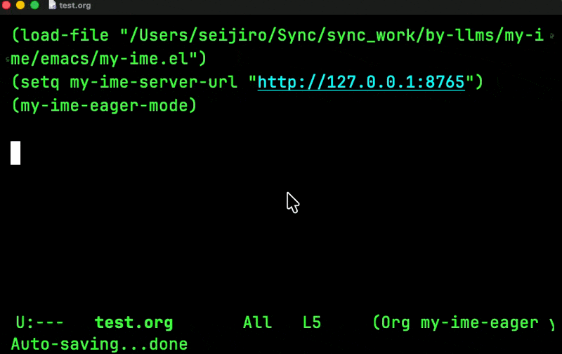

# my-ime.el

`my-ime` は、Emacs でローマ字入力した文章をローカルで日本語に変換する IME 補助ツールです。外部 API は使わず、Emacs Lisp からローカル HTTP サーバーを呼び、サーバー側で SKK 形式の辞書、ローマ字かな変換、`kkc` によるかな漢字変換を組み合わせます。

いまの中心機能は `my-ime-eager-mode` です。空白では入力中のローマ字を読みやすいひらがなやカタカナに変え、文末の `.` `,` `?` `!` や `RET` では文を確定変換します。



## 使い心地

入力中:

```text
kyou<SPC>                  -> きょう
きょう ha<SPC>              -> きょうは
きょうは totemo<SPC>         -> きょうはとても
きょうはとても tanosii.      -> 今日はとても楽しい。
きょうはとても tanosii<RET>  -> 今日はとても楽しい。
```

技術語:

```text
de-ta              -> データ
de-tawo yomu.      -> データを読む。
serverwo cachede   -> サーバーをキャッシュで
```

英語や壊したくない語:

```text
;;data is dead;;<RET>       -> data is dead
;;global state;;deyaru.     -> global stateでやる。
;;domain drive;;deyaru      -> domain driveでやる
;;domain drive;;deyaru<RET> -> domain driveでやる
```

`;;...;;` の中身はそのまま確定します。英語文、専門用語、関数名、概念名などを日本語化したくないときに使います。手動マーカーだけの行を確定するときは、行頭に残った空白も落とします。

## 変換モデル

サーバーは 2 つのエンドポイントを持ちます。

```text
/preedit
  空白入力時の軽い変換
  ローマ字 -> ひらがな
  SKK 辞書にあるカタカナ語は先に確定

/convert
  文末や RET の確定変換
  保護語を退避
  SKK 辞書で確定できる語を一時プレースホルダ化
  残りを kkc decoder でかな漢字変換
  保護語と辞書語を復元
```

`/preedit` は入力中の視認性を上げるための処理です。`/convert` は最終的な日本語文に寄せる処理です。

## Docker で起動

推奨の起動方法です。Python サーバー、`kkc` コマンド、`libkkc` の辞書データを Docker Compose の中に固定します。

```sh
make docker-up
make docker-smoke
```

`8765` がすでに使われている場合:

```sh
make docker-up PORT=8876
make docker-smoke PORT=8876
```

停止:

```sh
make docker-down
```

デフォルトでは `127.0.0.1` にだけ公開します。別マシンからアクセスしたい場合だけ、明示的に `MY_IME_BIND=0.0.0.0` を指定してください。

## ローカルで直接起動

Docker を使わない場合は、手元の `PATH` 上に `kkc` コマンドが必要です。

```sh
make run
make smoke
```

主な環境変数:

```sh
export MY_IME_BACKEND=kkc
export MY_IME_KKC_COMMAND=/path/to/kkc
export MY_IME_KKC_MODEL=sorted3
export MY_IME_KKC_NBEST=3
```

旧名の `LLM_IME_*` も互換のため読めますが、新しく設定する場合は `MY_IME_*` を使ってください。

## Emacs 設定

```elisp
(add-to-list 'load-path "/Users/seijiro/Sync/sync_work/by-llms/my-ime/emacs")
(require 'my-ime)

(setq my-ime-server-url "http://127.0.0.1:8765")

(add-hook 'org-mode-hook #'my-ime-eager-mode)
```

サーバーを別ポートで起動した場合:

```elisp
(setq my-ime-server-url "http://127.0.0.1:8876")
```

`my-ime-eager-mode` のキー:

```text
SPC       preedit 変換
. , ? !   確定変換
RET       現在行を確定変換して改行
C-j       普通の改行
C-c j e   eager-mode の切り替え
```

`C-j` は変換しません。編集で戻った場所に普通の改行を入れたいときの逃げ道です。

トリガー文字は変更できます。

```elisp
(setq my-ime-eager-trigger-chars '(?. ?, ?? ?! ?\s))
```

空白での preedit を止めたい場合:

```elisp
(setq my-ime-eager-space-preedit nil)
```

手動コマンドも使えます。

```elisp
(add-hook 'org-mode-hook #'my-ime-mode)

(global-set-key (kbd "C-c j j") #'my-ime-convert-dwim-async)
(global-set-key (kbd "C-c j r") #'my-ime-convert-region-async)
(global-set-key (kbd "C-c j s") #'my-ime-convert-last-sentence-async)
(global-set-key (kbd "C-c j p") #'my-ime-convert-paragraph-async)
```

`my-ime-mode` は手動変換コマンドを提供します。通常の改行キーは変更しません。

## 辞書

サーバーは起動時にプロジェクト内の `data/*.skk` を自動で読みます。標準で `data/my-ime-tech.skk` を同梱しており、技術文でよく使うカタカナ語や短い実用語を 2394 エントリ入れています。

例:

```text
kyou /今日/
totemo /とても/
de-ta /データ/
de-tawo /データを/
serverwo /サーバーを/
cachede /キャッシュで/
deploysuru /デプロイする/
```

辞書の ASCII 項目は、単純な部分一致ではなく ASCII の塊を辞書項目と助詞で分解できる場合だけ適用します。そのため `serverwo` は `サーバーを` になりますが、`kyoushi` の中の `kyou` は勝手に `今日` になりません。

ハイフン入りの短いローマ字語は入力語として扱います。たとえば `de-ta` や `de-tawo` は技術トークンとして保護せず、辞書で `データ` 系に変換します。一方、`my-ime-history` や `org-roam-node-find` のような識別子は保護します。

## HTTP API

`/health`:

```sh
curl -s http://127.0.0.1:8765/health
```

`/preedit`:

```sh
curl -s -X POST http://127.0.0.1:8765/preedit \
  -H 'Content-Type: application/json' \
  -d '{"text":"kyou ha totemo tanosii"}'
```

`/convert`:

```sh
curl -s -X POST http://127.0.0.1:8765/convert \
  -H 'Content-Type: application/json' \
  -d '{"text":"きょうはとてもたのしい."}'
```

## テスト

```sh
make test
```

テストでは HTTP サーバー、用語保護と復元、辞書、ローマ字変換、preedit、kkc バックエンドを確認します。

## 謝辞

`my-ime` は、突然どこからか現れた新しい IME ではありません。SKK、kkc、libkkc、そして日本語入力を Emacs や Unix の上で育ててきた多くの先人の仕事の上に、小さく乗せてもらっている道具です。

日本語入力は、ただ文字を置き換えるだけの処理ではなく、考えながら書く身体感覚そのものに近い領域です。ローマ字、かな、漢字、英語、コード、専門用語が同じ行の中で混ざる現実に、長い時間をかけて向き合ってきた SKK の思想や、かな漢字変換を実用的な形で扱えるようにしてきた kkc/libkkc の蓄積に深く感謝します。

このプロジェクトでやっていることは、LLM 時代の道具として見えているかもしれませんが、核にあるのは「入力中の人間を待たせない」「確定前の文字列を壊さない」「辞書と変換器を信頼できる小さな部品として組み合わせる」という、先人たちがずっと大事にしてきた感覚です。

SKK と kkc の文化、実装、辞書、そしてそれらを保守してきた方々に敬意を表します。ありがとうございます。

## ライセンス

my-ime の自作コードと同梱辞書 `data/my-ime-tech.skk` は MIT License です。詳細は `LICENSE` を見てください。

このリポジトリは prebuilt Docker image を同梱しません。`Dockerfile` はビルド時に Debian パッケージとして `libkkc-utils` と `libkkc-data` を取得します。これらの runtime component は GPL-3.0-or-later 系です。詳細は `THIRD_PARTY_NOTICES.md` を見てください。
